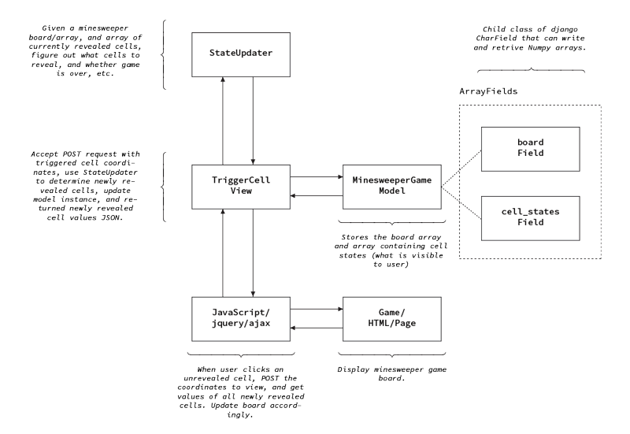

# Fellowsweeper

Django-based Minesweeper game for coding challenge.

## Installation

To install, clone the repository locally, create a `virtualenv` or `conda` environment, activate it, then run

```
pip install -e .
```

in the directory containing `setup.py`.

## System Overview

