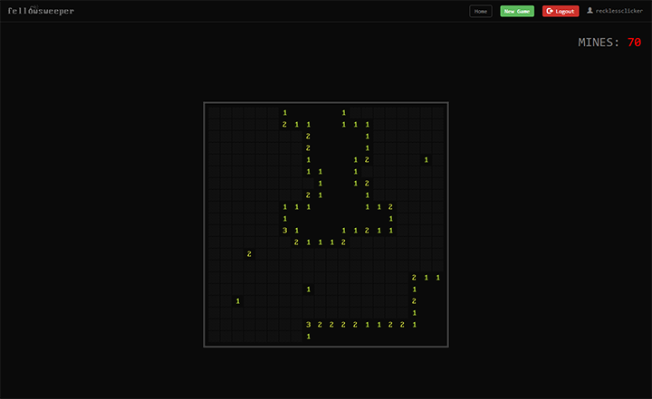

# Fellowsweeper

Django-based Minesweeper game for coding challenge. See below for installation instructions and system overview.



## Installation

To install, clone the repository locally, create a `virtualenv` or `conda` environment (Python 3.6),
activate it, then run

```
pip install -e .
```

in the directory containing `setup.py`. Then you can use `manage.py` to do whatever you like. The database
does not need to be initialized (you dont need to run `makemigrations` or anything).

## System Overview

